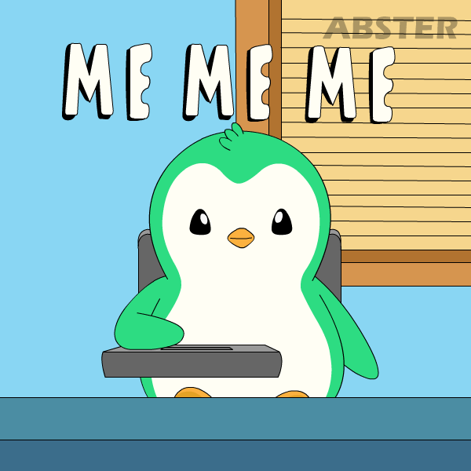
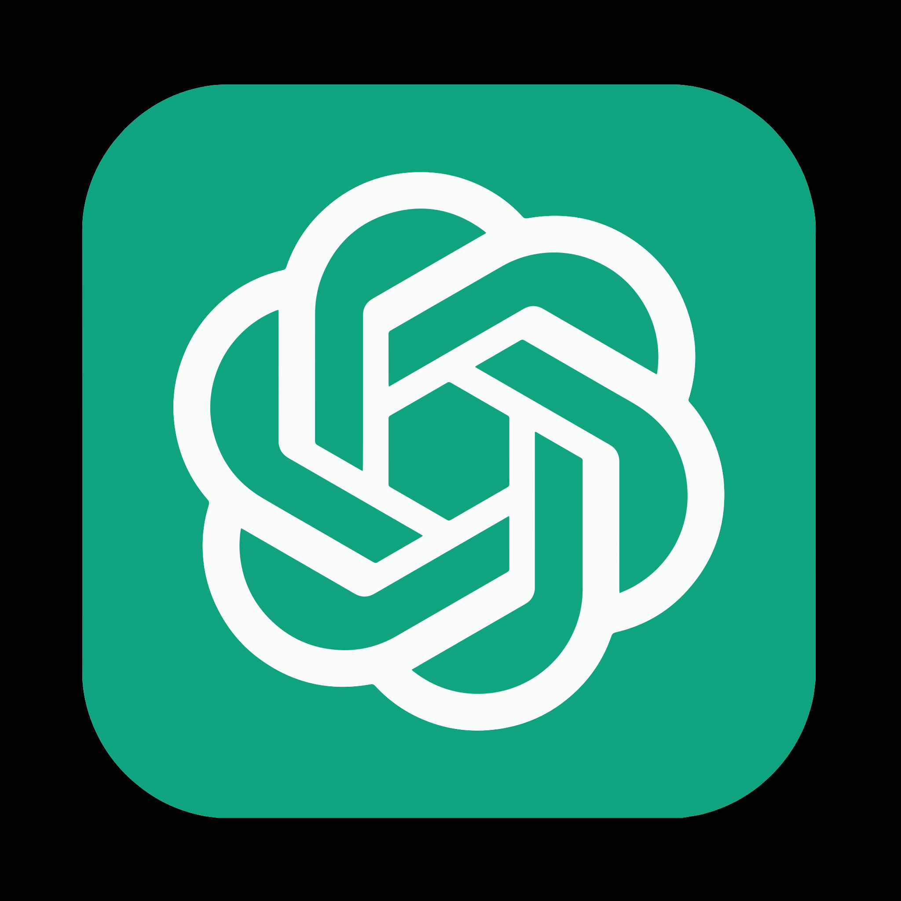

<!-- I'm Aditi ```verified```-->
<h2>&nbsp;Hi I'm <a href="https://www.linkedin.com/in/aditi-jain-80069a339/" target="_blank">Aditi</a>
</h2>

<div align="center">
  
</div>

<!-- Aspiring Data Analyst -->


<!-- Aditi -->
   

<!-- Typing Animation -->
[](https://git.io/typing-svg)

<!-- 👤 About Me -->



- *Passionate BBA (Finance) student with a minor in International Business.*
- *Strong leadership, communication, and coordination skills.*
- *Active participant in diverse activities; confident, creative, and results-driven.*
- *Solid analytical and quantitative foundation in finance.*
- *Growing understanding of global markets and cross-border business strategies.*
- *Practical exposure through industrial visits, community service, and projects.*
- *NSS Outreach Head; led health awareness and social campaigns.*
- *Certified in Data Visualization, Power BI, and Financial Analytics.*
- *Hands-on experience in data interpretation and dashboard creation.*
- *Consistent academic performer focused on continuous personal and professional growth.*

<!-- ## Dynamic Line  -->

 
<!-- ## 🚀 My Mission  -->


- *To secure a finance internship and gain practical industry exposure.*
- *To apply financial knowledge and data analysis to real business problems.*
- *To build a long-term career in Finance and Business Analytics.*
- *To contribute through strategic thinking, accuracy, and continuous learning.*

***Experience***

| Position | Institution Club & Duration |
|---|---|
| *Content Writer - Student Press* | *JIMS Rohini - Trainee* <br> `Sep 2025 - Present` |
| *Event Coordinator* | *Start Up Cell Blogs - Institute Innovation Council JIMS* <br> `Aug 2025 - Present` |
| *Event Coordinator* | *Gender Championship Club JIMS* <br> `Apr 2025 - Present`|
| *Coordinator* | *National Service Society JIMS* <br> `Sep 2024 - Present`|

***Volunteering***

### Coordinator

***Jagan Institute Of Management Studies*** `JIMS Rohini`
<br>
*Member of National Service Society* `Social Services`

<!-- ## Dynamic Line  -->


<!-- ## 💻 Skills & Expertise -->


 


<!-- ## 📊 Financial Analysis & Valuation -->
 ***📊 Financial Analysis & Valuation***


<!-- ## 🌍 Business & Management -->
 ***🌍 Business & Management***


<!-- ## Dynamic Line  -->


<!-- ## ⚙️ Tech Stack -->
***Tech Stack***

<!-- Skill buttons -->
<p align="center"> 
  
  
  
  
  
  
  
  
  
  
  
  
  
  
  
</p>

<!-- ## 🧠 Soft Skills -->
 ***🧠 Soft Skills***


<!-- ## Dynamic Line  -->


<!--## 🏆 Honors & awards -->
&nbsp;***Honors & awards***

- ***Best Performer*** `Apr 2025`<br>
*Panel Discussion by GCC on topic - Invisible Load and Emotional Labour*

- ***1st Prize*** `Mar 2025`<br>
*on Legal Lens Quiz Competition and Case Analysis*

- ***Honoured for being a Panelist in an insightful Panel Discussion*** <br>
*on Future of Startups in New Evolving World*
`Associated with JIMS` `Feb 2025`

- ***Group discussion and extempore***<br>
*Issued by Gender Championship Club*
`Associated with JIMS` `Jan 2025`

<!-- ## 📬 Connect with Me -->


<!-- Typing Animation / 🤝 Connect with me -->
[](https://git.io/typing-svg)

<!-- Social Media Linkes -->
<div align="center">
 
[](https://www.linkedin.com/in/aditi-jain-80069a339/)
[](https://github.com/aditij0918)
[](mailto:Aditij0918@gmail.com)
</div>

<!-- ## Dynamic Line  -->


<!-- ## 🚀 GitHub Performance Overview -->
&nbsp;***GitHub Performance Overview***

<!-- ## 🧠 Contribution Pulse -->
&nbsp;***Contribution Pulse***


<!-- ## Dynamic Line  -->


<!-- ⭐💫 Shower stars if you like my repos -->
<div align="center">

<a href="https://github.com/aditij0918/aditij0918" alt="GitHub Stars" title="Star my repositories">

</a>
</div>

<!-- Typing Animation / 🤝 Thanks for Visiting! -->
[](https://git.io/typing-svg)

<!-- ## 🤝 Contact me -->
<div align="center">
<!-- 💼 LinkedIn -->
<a href="https://www.linkedin.com/in/aditi-jain-80069a339/"></a>
<!-- 🆔 GitHub -->
<a href="https://github.com/aditij0918" target="_blank">
  
</a>
<!-- 📮 Gmail -->
<a href="mailto:Aditij0918@gmail.com" target="_blank">

</a>
</div>

<div align="center">
  
